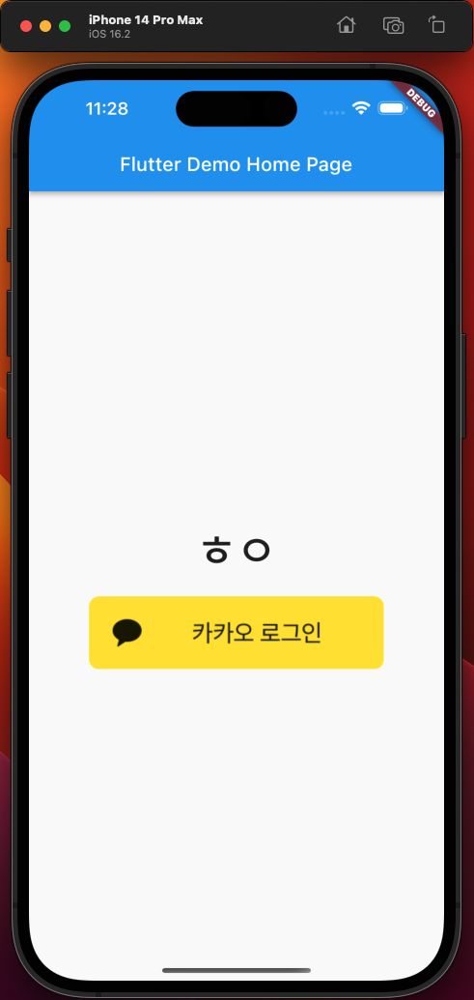
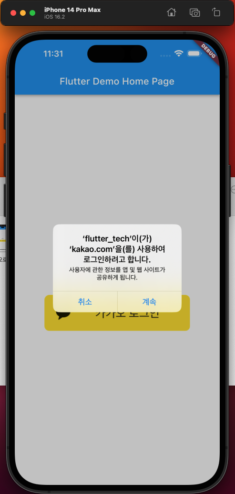

1월 3일
=
백준 : 11/51 (+2) 
<progress value="9" max="51"></progress>

강의 : 40/100 (+0)
<progress value="3" max="52"></progress>

기술 연습 : 6/100 (+5)
<progress value="3" max="52"></progress>

오늘은 연구실에서 현장을 갔다왔다. 만반의 준비를 하고 도착했는데 갑자기 빌드해놓은 앱은 하루밖에 안됐는데 사용할 수 없다고 뜨고, 맥북으로 빌드하려니까 2시간동안 붙잡고 있어도 안되고, 폰에 깔아놓은거라도 쓰려고 하니까 날씨가 너무 추워서 폰이 꺼져버렸다. 결국 다시 연구실에 와서 빌드를 하고 출발했고, 처음 현장 출발한게 9시 40분이었는데 왔다갔다 하고 마지막에 연구실 도착하니까 8시였다 ㅋㅋㅋ... 연구실 와서라도 공부를 좀 하려고 하는데 너무 지치기도 하고 늦기도 하고 쉽지 않다...

## 문제 풀이: 40분   
소마 문제집 2문제를 풀었다. 요즘 난이도랑 알고리즘 분류를 끄고 풀고있는데 이거 꽤 재미있는 것 같다. 뭔가 문제에 대한 편견 없이 순수하게 접근하게 되기도 하고, 알고리즘 분류를 보고 나면 풀이에 대한 생각이 좁혀지는데 그게 덜한 것 같아서 좋다. 코테도 이런거 없이 그냥 푸는거니까 문제를 분별하는 능력이 좋아지지 않을까 한다.

## 기술 연습: 2시간 반
카카오 로그인을 위한 프로젝트 세팅을 했다. 근데 원리만 읽었을땐 뭔가 엄청 복잡했는데 문서가 워낙 잘 되어 있어서 사용하는거 자체는 꽤 쉬워 보였다. 예제 코드도 그냥 공식문서 복붙해서 넣으니까 대충 완성이 됐다. 근데 토큰을 발급받고 관리하는 시스템을 설계하는게 중요해보이는데 토큰 관리는 더 찾아봐야겠다.

카카오 공식문서 너무좋아요

## 강의 듣기: 0시간
현장 이슈로 인해 오늘은 패스~

## 여담:
진짜 오늘도 일지쓰길 잘했다는 생각이 100번 들었다. 월곶을 2번 갔다와서 차만 6시간 타고 매우 피곤하고 힘든 상황이었지만 일지를 생각하며 막상 자리에 앉으니 생각보다 집중이 잘 됐다.