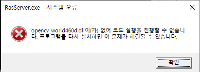

VS C++ 외부 라이브러리 연결하기
=

이번에 windows에서 opencv랑 librdkafka 설치를 하게 되면서 VS에서 C++의 외부 라이브러리를 사용할 때 해야 하는 설정들이 비슷하다는걸 느껴 이를 기록하려 한다. opencv를 기준으로 설명하겠다.

## opencv
[opencv sourceforge](https://sourceforge.net/projects/opencvlibrary/files/4.6.0/opencv-4.6.0-vc14_vc15.exe/download)    
우선 위 사이트에서 opencv설치기를 다운받고 원하는 위치에 설치한다. 다만 설치 경로에 한글이 들어가지 않는 것이 좋다. 한글이 들어가면 안될 수도 있다.    

    

이후 VS를 열어 원하는 프로젝트를 만든 뒤, 왼쪽 상단의 프로젝트 탭을 누르면, 위 그림과 같이 <프로젝트 이름>속성 버튼이 있다. 속성 탭에 들어간다.

   

우선 왼쪽 상단의 구성(C): 활성(Debug) 라고 되어 있는데, 이를 모든 구성으로 바꾸는 것이 좋다. 디버그 모드와 릴리즈 모드 두 가지의 구성을 다르게 설정할 수 있도록 있는 것인데, 디렉터리 설정은 두 구성 모두에게 해 주어야 한다. 두 구성을 구분해서 설정해야 하는 것은 이후에 나올 것이다.

VC++ 디렉터리 탭에 2가지 중요한 것이 있는데, 하나는 포함 디렉터리이고, 하나는 라이브러리 디렉터리이다.   

포함 디렉터리에는 보통 헤더 파일(.h/.hpp)이 있는 폴더 경로가 들어가게 된다. 폴더 이름은 보통 include이다. 필자는 C드라이브에 바로 opencv를 설치해서 경로는 C:\opencv\build\include 였다.

라이브러리 디렉터리에는 보통 라이브러리 파일(.lib)이 들어간다. 폴더 이름은 보통 lib이다. 경로는 C:\opencv\build\x64\vc15\lib 였다.

본인의 경로에 맞게 잘 넣어주면 된다.


이후 위 사진처럼 링커 -> 입력 탭을 누르면 추가 종속성 칸을 확인할 수 있다. 이제 해당 칸에 lib파일의 파일명을 넣어주면 된다. 파일 이름은 위에서 라이브러리 디렉터리에 넣어줬던 폴더를 열어보면 확인할 수 있다.


이때 주의해야 할 것이 위 사진처럼 lib폴더를 열어보면 lib파일이 d가 붙어있는 것과 붙지 않은 것의 2가지 종류가 있는데, d의 의미는 debug를 말하는 것이다. 따라서 d가 붙은 lib파일은 debug구성에 넣어주어야 하고, 붙지 않은 것은 release구성에 넣어주어야 한다.    
참고로 파일 이름에 있는 460은 opencv 4.6.0을 설치해서 그런 것이다. 본인의 opencv버전에 따라 다를 수 있다.


위 사진처럼 구성을 선택하여 설정할 수 있다. 라이브러리에 따라서 디버그/릴리즈가 구분되지 않기도 하는데, 확인을 했을 때 d가 있는 것과 없는 것의 두가지로 나뉜다면 꼭 구성별로 설정해주어야 한다.

<br>
여기까지 다 했다면 아래 코드를 넣고 실행해보자. 프로젝트 폴더에 아무 비디오나 넣고 video.mp4 대신 그 비디오의 이름을 넣으면 된다. 비디오 창이 뜨면 성공이다.

```C++
#include <opencv2/core.hpp>
#include <opencv2/videoio.hpp>
#include <opencv2/highgui.hpp>
#include <iostream>


using namespace cv;
using namespace std;

int main() {
	VideoCapture video("video.mp4");
	Mat img;
	while (video.read(img))
	{
		imshow("title",img);
		waitKey(20);
	}
}

```
하지만 아래처럼 뜨면서 실행되지 않을 것이다.



이는 dll파일을 넣지 않았기 때문이다. 아까 lib폴더 경로에 가보면 옆에 bin폴더가 있을텐데, 필자를 기준으로 C:\opencv\build\x64\vc15\bin 에 위치했다.


bin폴더 안에서 "opencv_world460.dll" 파일과 "opencv_world460d.dll" 두 개를 복사해 프로젝트 폴더에 넣으면 된다. dll파일은 실행할 때 자동으로 링크되기 때문에 d를 구분할 필요가 없고 둘 다 넣기만 하면 된다.     
<br>
이걸로 끝이다. 위 코드를 다시 실행하면 잘 될 것이다.     
정리하자면, 
1. 라이브러리 설치 
2. VC++ 포함/라이브러리 디렉터리 설정
3. 링커->입력 lib파일 설정 (구성 확인)
4. dll파일 프로젝트 디렉터리에 복사

librdkafka는 NuGet에서 설치할 수 있는데, VS에서 프로젝트 속성 탭 바로 위의 NuGet 패키지 관리 탭에 들어가면 된다. 근데 NuGet으로 설치하면 자동으로 링크 설정을 해줄줄 알았는데, 직접 해야된다. 프로젝트 폴더에 설치된걸 위와 같은 방법으로 설정하니 잘 실행되는 것을 확인하였다.

참고로 dll이 개수가 많고 여러 프로젝트에서 사용한다면 dll이 모여있는 폴더를 환경 변수에 넣는것을 추천한다.