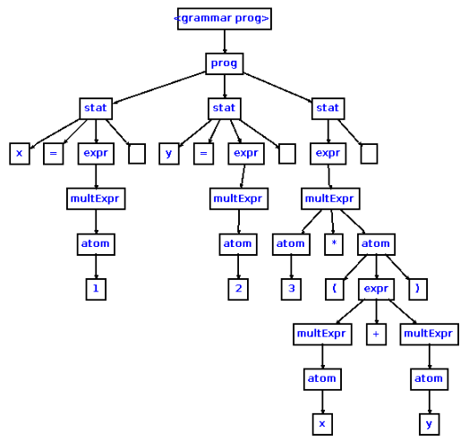
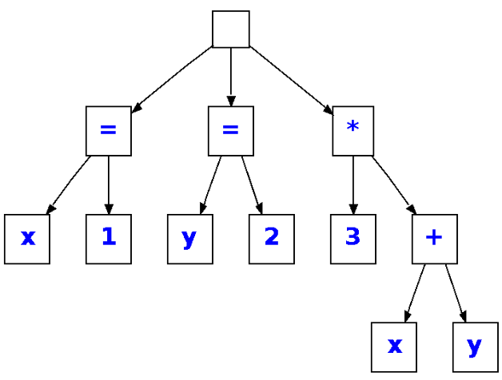

컴파일러 기초
=

컴파일은 기본적으로 구문 분석 -> AST 생성 -> 최적화 -> 코드 생성 -> 링킹 과정으로 진행된다. 이 과정 중 컴파일러 프론트엔드가 담당하는 영역은 구문 분석 및 AST생성으로, 오늘은 이 과정이 어떻게 구현되는지 알아보려 한다.

### Tokenizer
어떤 구문을 토큰화하는 역할을 한다. 토큰은 어휘 분석의 단위이며, 문자, 단어, 단어구 등 의미있는 단위로 정해진다. 문자열을 토큰으로 분해하면 구조적으로 표현할 수 있어 처리하기 한결 쉬워진다. 자바의 StringTokenizer 를 생각하면 된다.

### Lexer
토큰의 의미를 분석해 분류하는 역할을 한다. Tokenizer와 Lexer가 하는 일을 합쳐서 Lexical Analyze 라고 한다. 보통 각 구문의 종류를 클래스로 표현하거나 enum을 사용해서 분류한 뒤 Parser에게 넘겨주는 듯하다.

### Parser
Parser 는 Lexical Analyze 된 데이터를 구조적으로 나타낸다. 이때 구문이 문법적으로 맞는지 검사도 진행한다. 이를 통틀어서 Syntax Analyze 라고 한다. 이 과정을 통해 만들어지는 자료구조가 Abstract Syntax Tree이다. 구문을 트리로 표현하는 이유는 전체 구문이 쪼갤 수 없는 작은 구문들이 모여 중첩되면서 구성되기 때문에 계층 구조를 표현하기 좋은 트리를 사용하게 된 것 같다. 

AST가 어떻게 생겼는지는 [자바스크립트 AST 생성기](https://astexplorer.net/)를 들어가보면 잘 이해할 수 있다. 약간 문자열로만 존재하던 코드를 객체지향적으로 표현하면 AST가 되는 느낌이다.

파이썬도 AST를 확인할 수 있는데, 무려 빌트인에서 지원한다. 역시 exec함수같이 메타적인걸 많이 지원하는 파이썬답다. 만들어진 AST를 compile 함수에 쓸 수도 있다.

```python
import ast

code = "print('Hello, world!')"
tree = ast.parse(code)

print(ast.dump(tree))

#실행 결과
"Module(body=[Expr(value=Call(func=Name(id='print', ctx=Load()), args=[Constant(value='Hello, world!')], keywords=[]))], type_ignores=[])"
```

근데 좀 찾아보니까 Parser가 구문 분석 트리(Parse Tree)를 만든다고도 하던데 AST를 만들게 할지 PT를 만들게 할지는 구현하기 나름인 것 같다. 참고로 PT는 문법 구조를 생략하지 않고 토큰 전체를 구조화한거고, AST는 필수 구문 요소만 남기고 PT에서 필요없는 부분을 생락한 추상화 버전이라고 보면 된다.

스택오버플로우에서 찾은 예시를 보자. 코드는 아래와 같다.

```c++
x=1
y=2
3*(x+y)
```
이 코드를 Parse Tree로 표현하면 아래와 같을 것이다.



확실히 문법 요소가 모두 표현되어 복잡한 모습이다. AST는 아래와 같다.



의미를 해치지 않는 선에서 필요한 구성 요소만 남겨 훨씬 간결하다.

이렇듯 Parser가 AST를 만들게 되면 optimizer가 해당 트리로부터 최적화 작업을 진행하고, 최적화된 트리를 가지고 기계어 코드를 생성하면 실행 파일이 만들어지는 것이다.
