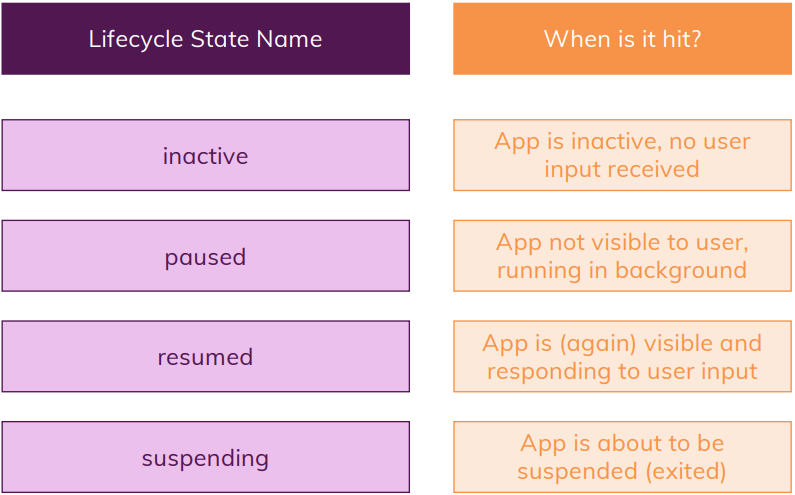

Flutter 메모
=

* Row, Column 정렬 https://beomseok95.tistory.com/m/310

* 현재 기기의 방향, 화면 크기를 얻어오는 법:
```dart
MediaQuery.of(context).size
MediaQuery.of(context).orientation
```
<br>

* 키보드의 맨 위 좌표를 얻어오는 방법:
```dart
MediaQuery.of(context).viewInsets.bottom
```
<br>

* dart 2.2.2 부터 리스트 내포형 if 사용가능. (중괄호 사용 못함)
```dart
children[
    if (isLandscape) Row(...)
    if (isLandscape) ...[OutlinedButton(), OutlinedButton()] 
    //여러개 하고싶으면 이런식으로 하면 될듯?
]
```
<br>

* LayoutBuilder : Builds a widget tree that can depend on the parent widget's size.     
constraints 인자를 받아서 부모 위젯의 크기에 맞게 위젯 사이즈를 설정하고 반응형으로 만들 수 있음.    <br><br>
아래와 같은 경우에 호출된다고 함.
    - 처음으로 widget이 layout 될 때
    - 부모 widget의 constraint가 바뀔 때
    - 부모 widget이 해당 widget을 업데이트할 때

```dart
return LayoutBuilder(
    builder: (BuildContext context, BoxConstraints constraints) {
        final width = constraints.maxWidth;
        final height = constraints.maxHeight;
        final ratio = width / height;
        return Column(...)
    }
)
```
<br>

* dart:io 를 import 하면 현재 플랫폼을 확인할 수 있다.

```dart
import 'dart:io';

void main() {
  print(Platform.isAndroid);
  print(Platform.isFuchsia);
  print(Platform.isIOS);
  print(Platform.isLinux);
  print(Platform.isMacOS);
  print(Platform.isWindows);
}
```
<br>

* 제스처 디텍팅 하는 방법 
```dart
InkWell //누르면 기본 버튼 누른 효과 나옴 (잉크 퍼지는 효과)
GestureDetector //좀 더 섬세한 컨트롤 가능. 효과 x
```
<br>

* 보이지 않는 자식을 가진 GestureDetector의 터치 이벤트 활성화 하는 법
```dart
onTap: () {},
behavior: HitTestBehavior.opaque, //이걸 사용하면 된다
```
<br>

* primarySwatch에 들어갈 MaterialColor 만드는 방법   
https://points.tistory.com/65

<br>

* 이미지로만 이루어진 버튼의 눌림 효과 내는법: 
```dart
Stack(
    children: [
        Image.asset(
            "assets/images/kakao_login_image.png",
            scale: 1.2,
        ),
        Positioned.fill( //스택에서 자리잡을 때 쓰는 위젯
            child: Material( //이 위젯이 있어야지 잉크 효과가 보임
                color: Colors.transparent,
                child: InkWell( //제스쳐디텍터 + 잉크퍼짐효과 위젯
                    onTap: kakaoLogin,
                ),
            )
        )
    ],
)
```
<br>

* 위젯의 라이프사이클

    Stateless Widget :
    - 생성자 호출

    - build()

    <br>

    Stateful Widget :   
    - Stateful 위젯 생성자 호출

    - build()

    - State의 생성자 호출

    - initState()    
    State가 시작될 때 딱 한번만 호출되는 함수

    - build()

    - setState()   
    직접 업데이트를 알릴 때 쓰는 함수

    - didUpdateWidget()   
    State랑 관련된 위젯이 업데이트 될 때 호출되는 함수

    - dispose()
    위젯이 제거되었을 때 호출되는 함수


    Stateless Widget은 뭔가 업데이트 될 때마다 계속해서 생성자가 호출되며 초기화되고, Stateful Widget 역시 생성자가 매번 호출되고 초기화되지만, State는 한번 생성되고 Stateful Widget이 파괴되기 전까지는 독립적으로 저장되며, 상태를 유지하게 되는 것. (Element Tree쪽에 저장되는 걸로 앎)

<br>

* 앱의 라이프사이클



flutter에서는 WidgetsBindingObserver로 현재 상태를 얻을 수 있다.