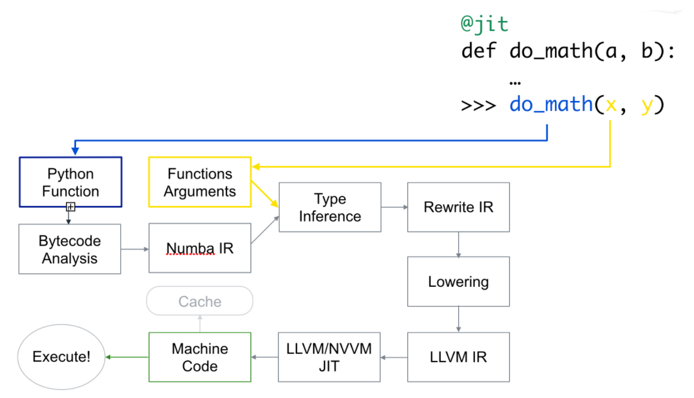

numba
=

LLVM 공부를 하던 중, 파이썬 코드를 LLVM IR로 변환해서 컴파일을 하면 재밌겠다는 생각이 들었다. 근데 인터넷을 찾아보니 역시나(?) 똑같은 기능을 하는 라이브러리가 만들어져 있었고, 그게 numba였다.

내 생각보다 더 좋게 구성돼있었는데, 특징은

* 모든 코드를 컴파일 하는 것이 아니라 원하는 함수에만 데코레이터를 달아 사용할 수 있다.

* 함수를 처음 호출할 때 컴파일된다. 즉 런타임 시점에 IR코드로 변환되고, 그게 다시 llc로 넘어가서 기계어로 변환된다. 그리고 이걸 캐싱도 해준다. (과정 자체는 네이티브 컴파일러랑 다를게 없는데 이 과정이 런타임에 일어나기 때문에 numba는 그냥 컴파일러가 아니라 JIT 컴파일러다.)

* numpy랑 호환이 된다.

과정은 아래와 같다. 첫 호출땐 함수 자체를 LLVM을 이용해서 기계어로 변환해놓고, 이후 호출때는 캐싱해놓은 걸 사용한다.



그래서 코드로 비교를 해 보았다.

```python
from numba import jit
from time import time

def fib(n):
    if n == 0: return 0
    if n <= 2: return 1
    return fib(n-1) + fib(n-2)

@jit(nopython=True, cache=True)
def numba_fib(n):
    if n == 0: return 0
    if n <= 2: return 1
    return numba_fib(n-1) + numba_fib(n-2)

numba_fib(1)

st = time()
numba_fib(40)
ed = time()
print(f"numba: {ed - st}초")

st = time()
fib(40)
ed = time()
print(f"파이썬: {ed - st}초")

```
데코레이터 인자가 두 개가 있는데, cache는 컴파일 결과를 캐싱하겠다는 의미이다.

nopython은 파이썬 인터프리터를 아예 사용하지 않겠다는 것으로, int, float 등 몇몇 타입에 대해서만 동작이 가능하지만 가장 최적의 컴파일 코드를 제공해 매우 빠르다. nopython모드에 딕셔너리 같은 다른 객체가 사용되면 오류가 난다.

다른 객체를 사용하는 코드도 numba를 사용하고 싶다면 nopython 인자를 빼고 object mode로 사용하면 되는데, 이 역시 기계어로 변환되긴 하지만 최적의 속도를 보장하진 않는다고 한다.

데코레이터가 njit랑 jit두 개가 있는데 njit는 @jit(nopython=True)랑 똑같은거다.

그래서 결과를 보면
> numba: 0.4825708866119385초   
파이썬: 20.44295573234558초

대락 42.3배 빠르다.

코드에서 numba_fib(1) 을 미리 호출하여 밑에서 호출을 할 때는 컴파일 된 코드를 사용하도록 했는데, 웃긴건 저렇게 미리 컴파일 안해도 numba가 훨씬 빠르다는거다.

미리 호출하는 코드를 지우면 numba_fib(40)의 실행 시간은 0.7초로 여전히 30배 가까이 빠르다.

이외에도 병렬 실행도 가능하고, GPU 가속도 지원한다고 한다. 굉장히 괜찮은 것 같다. 혹시 파이썬으로 프로젝트 할 일 있으면 적극적으로 활용해야겠다.