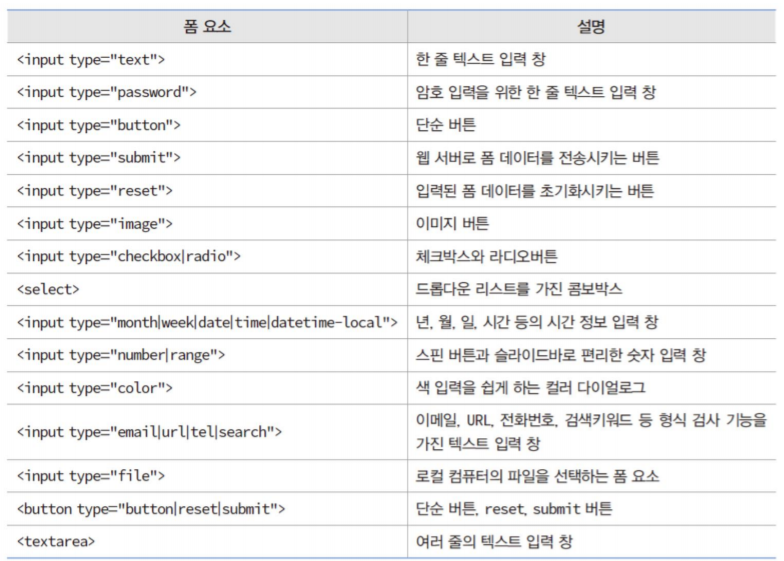

Web 메모
=
내용 쌓이면 파일 분할함

<hr>

### HTML
* class랑 id의 차이: <br> class는 같은 이름 중복 사용 가능, id는 불가능. 그리고 css에서 class는 .btn 처럼 쓰는데 id는 #btn으로 써야함

* ico파일을 가지고 favicon을 정해줄 수 있음 (탭 옆에 작게 뜨는 아이콘)
```html
<link rel="icon" href="./favicon.ico" />
```

* 요즘 웹의 개발 트렌드는 html은 스타일적인 요소를 모두 빼고 대신 시멘틱 태그를 활용해 어떤 요소가 어떤 의미인지를 가지는지 구조적인것에 집중하고, 나머지 스타일을 모두 css가 처리하는 방식인 것 같음. 
    - 시멘틱은 ‘의미가 있는’, ‘의미의’ 라고 해석
    - 기존의 표현(Display) 위주의 웹 문서에 데이터(Data)의 구조적 개념을 추가하기 위한 노력
    - 웹이 시멘틱(semantic)해지면 웹 문서는 의미 있게 구조화, 조직화 되며 이를 해석하는 검색 엔진이나 문서 해석기에서는 보다 정확하게 웹 문서를 판별하고 해석 및 처리 가능
<br><br>

* form 요소:

input 태그에다가 type속성을 가지고 다양하게 요소를 만들 수 있음.

    - type중 submit, reset, button, image 이 4가지는 모두 버튼을 만들어줌. 각각 조금씩 차이가 있는데 자세한건 위 이미지 참고.

    - 버튼을 만드는 방법이 input태그 + type="위 4가지 중 하나" 랑 button태그를 그냥 사용하는 방법이 있는데, input태그로 버튼을 만들면 위의 내용대로 작동하고, button태그로 버튼을 만들면 기본 효과가 type="submit"임. (그래서 조심해야 함)    
    input은 단일 태그라서 안에 다른 내용을 넣을 수 없는데 button태그는 단일이 아니라서 좀 더 세부적으로 꾸밀 수 있음.

    - 라디오 버튼은 name이 같은 라디오 버튼끼리 그룹으로 작동함

    - 라디오버튼/체크박스는 디폴트 선택값 checked로 표현, 콤보 박스(select)는 selcted로 표현

* datalist와 select태그:    
    - datalist는 선택지를 보여주는 느낌, input 태그랑 연동해서 사용. select는 진짜로 선택지 중 하나만 선택해야 함. 다만 둘 다 option 태그를 사용해서 선택지를 보여줌.    
    - optgroup태그로 선택지를 그룹화 할 수 있는데 datalist는 optgroup이 안먹힘.    
    - option태그가 좀 이해가 안되는게 value랑 label 속성이 있고 단일 태그가 아니라서 태그 안에도 내용을 넣을 수 있는데, 실행해보면 태그 안에 넣은 내용은 무시되고 label속성에 넣은 값만 표시됨. value는 form이 전송될 때 실제로 날아가는 데이터니까 이해가 되는데 label이랑 태그 내부 값을 왜 분리해놓은건지 모르겠음.
<br><br>
* label 태그로 폼 요소와 캡션을 하나로 묶을 수 있음. 이를 이용해 label태그 안에 요소들을 넣으면 그 요소들 중 아무거나 클릭해도 폼 요소가 클릭된 것처럼 작동함.    
label태그의 속성인 for="form요소 id" 속성을 통해서도 가능.
```html
<!DOCTYPE html>
<html>
<head>
    <title>캡션을 가진 라디오버튼</title>
</head>

<body>
    <h3>먹고 싶은 것 하나만 선택?(&lt;label&gt;이용)</h3>
    <hr>
    <form>
        <label>
            <input type="radio" name="china" value="1">
            짜장면 
        </label><br>
        <label>
            <input type="radio" name="china" value="2" checked>
            짬뽕 
        </label><br>
        <label>
            <input type="radio" name="china" value="3">
            탕수육 
        </label>
    </form>
</body>
</html>
```

* fieldset 태그로 폼 요소들을 그룹으로 묶을 수 있음. 그룹 제목은 legend태그로 설정 가능

<hr>

### CSS

* none을 써주면 그 효과를 제거할 수 있음. <br> 예를 들어, a태그를 달면 자동으로 밑줄이 생기는데, 아래처럼 하면 효과가 제거됨.
```css
text-decoration: none;
```

* 태그 뒤에 : last-child, hover 같은 것을 붙여서 특정 상태나 특정 자식에 대해 스타일을 정의할 수 있음. nth-child(3) 으로 n번째 자식도 됨.    
 li:before 도 있는데 리스트 아이템의 뒤에 (li들 사이에) 뭔가를 넣고 싶을 때 사용할 수 있음

```css
.container .loginBox a:first-child:hover,
.container .regiBox a:nth-child(0),
header .inner .submenu .menu li::before 
```
* display 타입을 flex로 많이 사용함. 정렬이나 갭 넣어주는게 편하다고 함. 자세한건 아직 덜 배움.

* position이라는 속성이 있는데 기본값은 static이고, relative, absolute, fixed라는 것을 많이 쓴다고 함.    
relative를 쓰면 원래 속성과 달라지진 않지만, 위치 지정 요소로써 작동할 수 있음. 자신의 원래 위치로부터 top, left등을 계산하게 됨.    
absolute를 쓰게 되면 그 요소가 붕 뜬 것처럼 되어 다른 요소는 그 요소를 무시하고 배치되고, 그 요소는 제일 앞으로 나오게 됨.    
fixed는 absolute와 비슷한데, 스크롤을 해도 위치를 고정시킬 수 있음.     
fixed와 absolute 모두 가장 가까운 위치 지정 요소를 가진 조상을 기준으로 거리를 계산함.     
참고: https://developer.mozilla.org/ko/docs/Web/CSS/position

<hr>

### JS
* js에서 어떤 요소를 변수에 가져온 뒤에, 그 변수의 classList를 통해 css를 추가하거나 제거할 수 있음. 추가 제거 모두 class의 이름으로 함.
